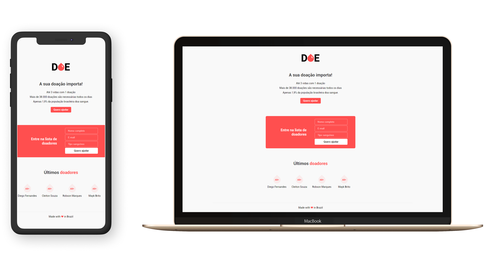

<h1 align="center">
    Doe Vida :heart:
</h1>

<h4 align="center">
  Code and coffee ☕
</h4>

  <a href="#ghost-tecnologias">Tecnologias</a>&nbsp;&nbsp;&nbsp;|&nbsp;&nbsp;&nbsp;
  <a href="#computer-projeto">Projeto</a>&nbsp;&nbsp;&nbsp;|&nbsp;&nbsp;&nbsp;
  <a href="#rocket-iniciando-aplicação">Iniciando aplicação</a>&nbsp;&nbsp;&nbsp;|&nbsp;&nbsp;&nbsp;
  <a href="#round_pushpin-acesse">Acesse</a>

 

  

## :ghost: Tecnologias

Esse projeto foi desenvolvido com as seguintes tecnologias:

- [React.js](https://reactjs.org)

## :computer: Projeto

O projeto consiste em uma página estática sobre doação de sangue. 
Desenvolvido durante a Maratona Dev 03 pela [Rocketseat](https://github.com/Rocketseat) :rocket:.

## :rocket: Iniciando aplicação

- Clone este repositório usando `git clone https://github.com/brendamatias/doe-vida.git`;
- Mova-se para diretório da aplicação: `cd doe-vida`;
- Execute `yarn install` ou `npm install` para instalar as dependências;
- Inicie a aplicação com `yarn serve` ou `npm serve`;

## :round_pushpin: Acesse

O projeto pode ser visto clicando [aqui](https://brendamatias.github.io/doe-vida/).

---

### <a href="https://www.linkedin.com/in/brenda-matias/">LinkedIn</a>
